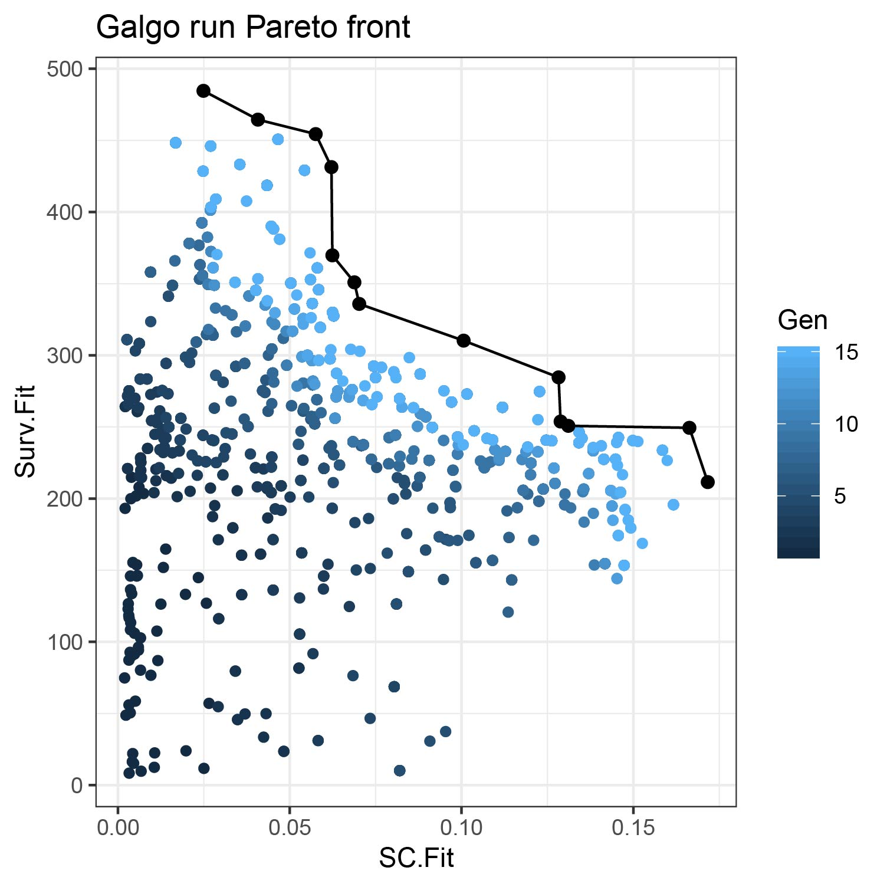
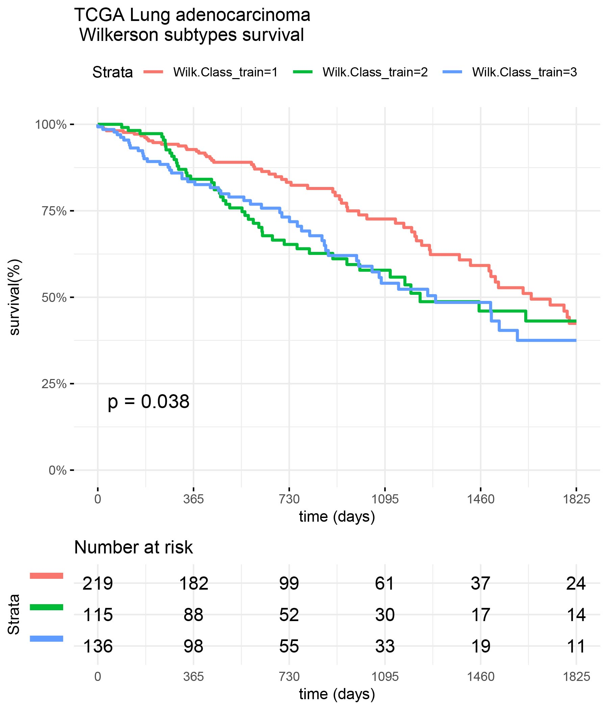
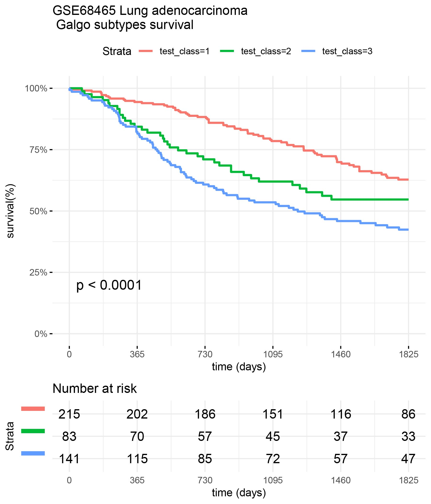
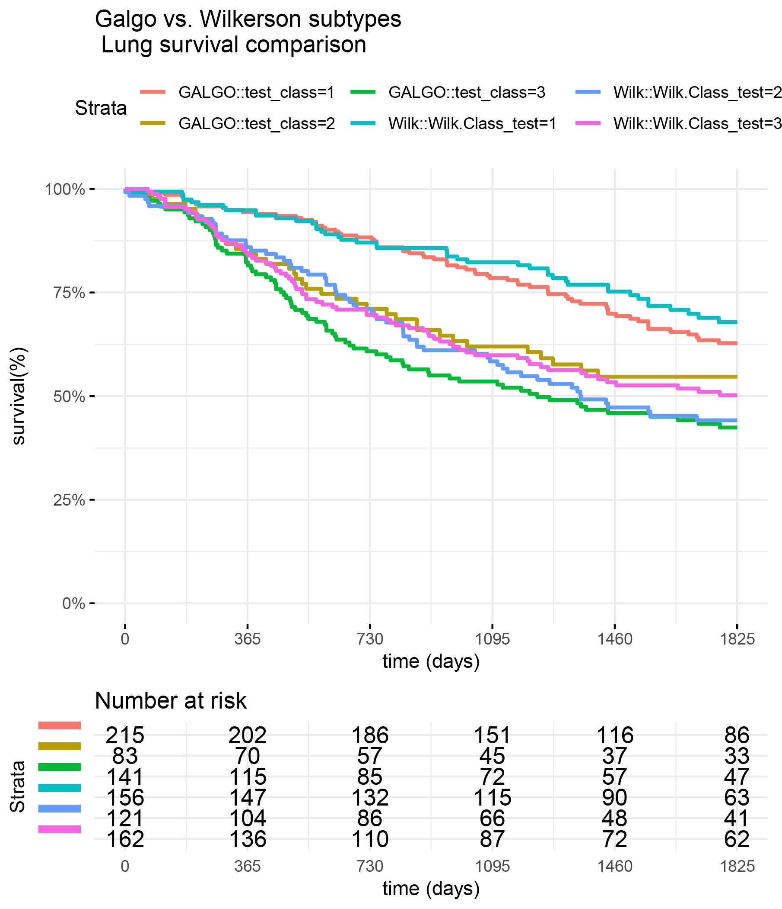

```{r setup, include = FALSE}
knitr::opts_chunk$set(
  collapse = TRUE,
  comment = "#>",
  eval=FALSE,
  warning=FALSE,
  message = FALSE
)
```


# Overview

In the new era of omics data, precision medicine has become the new paradigm of cancer treatment. Among all available omics techniques, gene expression profiling, in particular, has been increasingly used to classify tumor subtypes with different biological behavior. 
Cancer subtype discovery is usually approached from two possible perspectives:

-	Using the molecular data alone with unsupervised techniques such as clustering analysis.
-	Using supervised techniques focusing entirely on survival data.

The problem of finding patients subgroups with survival differences while maintaining cluster consistency could be viewed as a bi-objective problem, where there is a trade-off between the separability of the different groups and the ability of a given signature to consistently distinguish patients with different clinical outcomes. This gives rise to a set of optimal solutions, also known as Pareto-optimal solutions.
To overcome these issues, we combined the advantages of clustering methods for grouping heterogeneous omics data and the search properties of genetic algorithms in galgoR: A flexible yet robust multi-objective meta-heuristic for disease subtype discovery based on an elitist non-dominated sorting genetic algorithm (NSGA-II), driven by the underlying premise of maximizing survival differences between groups while getting high consistency and robustness of the clusters obtained.

# Algorithm

In the galgoR package, the NSGA-II framework was used for finding multiple Pareto-optimal solutions to classify patients according to their gene expression patterns. Basically, NSGA-II starts with a population of competing individuals which are evaluated under a set of fitness functions that estimate the survival differences and cohesiveness of the different transcriptomic groups. Then, solutions are ranked and sorted according to their non-domination level which will affect the way they are chosen to be submitted to the so-called "evolutionary operators" such as crossover and mutation. Once a set of well-suited solutions are selected and reproduced, a new offspring of individuals composed of a mixture of the "genetic information" of the parents is obtained. Parents and offspring are pooled and the best-ranked solutions are selected and passed to the next generation which will start over the same process again.

# Installation

## galgoR library 

To install galgoR package, start R and enter:
```{r install}
devtools::install_github("https://github.com/harpomaxx/galgo")

library(galgoR)
```

## Examples datasets

To standardize the structure of genomic data, we use the [ExpressionSet](https://www.bioconductor.org/packages/release/bioc/html/Biobase.html) structure for the examples given in this guide. The `ExpressionSet` objects can hold different types of data in a single structure but in this case we opted for using a simplified format to facilitate the example to those not familiar with the [Biobase](https://www.bioconductor.org/packages/release/bioc/html/Biobase.html) package. The `ExpressionSet` objects are formed mainly by:

- A matrix of genetic expression, usually derived from microarray or RNAseq experiments. 
- Phenotypic data, where we find information on the samples (condition, status, treatment, survival, and other covariates). 
- Finally, these objects can also contain Annotations and feature Meta-data.

To start testing galgoR, the package contains two reduced lung adenocarcinoma gene expression datasets ([TCGA](https://gdc.cancer.gov/about-data/publications/luad_2014) and [GSE68465](https://www.ncbi.nlm.nih.gov/geo/query/acc.cgi?acc=GSE68465)), that can be download using the function use_rna_luad(). Additionally, It also contains the [Wilkerson's centroids](http://cancer.unc.edu/nhayes/publications/adenocarcinoma.2012/wilkerson.2012.LAD.predictor.centroids.csv.zip) to perform lung adenocarcinoma sample classification. 
 
```{r example}
 rna_luad<- use_rna_luad()
 TCGA<- rna_luad$TCGA #Access TCGA dataset
 GSE68465<- rna_luad$GSE68465 #Access GSE68465 dataset

 #To access gene expression data
 TCGA_expr<- TCGA$expression_data

 #To access feature data
 TCGA_features<- TCGA$feature_data

 #To access clinical data
 TCGA_clinic <- TCGA$pheno_data

 #To get wilkerson centroids
 WilkCentroids <- rna_luad$WilkCentroids
```


# Examples

## Loading data 


```{r load}
rna_luad <- use_rna_luad()
```

We will also load the `survival` library

```{r survlibrary, eval=TRUE}
library(survival)
```


## Run galgo()

The main function in this package is galgo(). It accepts an expression matrix and survival object to find robust gene expression signatures related to a given outcome.
This function contains some parameters that can be modified, according to the characteristics of the analysis to be performed.

### Setting parameters

The principal parameters are:

- population: a number indicating the number of solutions in the population of solutions that will be evolved
- generations: a number indicating the number of iterations of the galgo algorithm
- nCV: number of cross-validation sets
- usegpu: logical default to FALSE, set to TRUE if you wish to use gpu computing (gpuR package must be properly installed and loaded)
- distancetype: character, it can be 'pearson' (centered pearson), 'uncentered' (uncentered pearson), 'spearman' or 'euclidean'
- TournamentSize: a number indicating the size of the tournaments for the selection procedure
- period: a number indicating the outcome period to evaluate the RMST

```{r parameters}
population <- 30 # For testing reasons it is set to a low number but ideally should be above 100            
generations <-15 # For testing reasons it is set to a low number but ideally should be above 150            
nCV <- 5                      
distancetype <- "pearson"     
TournamentSize <- 2
period <- 1825
```

### Expression matrix

Create an expression matrix for the TCGA_LUAD data example.

```{r TCGA_expr}
TCGA_expr <- rna_luad$TCGA$expression_matrix
```

### Survival Object

The 'OS' object is created by the Surv() function of the survival package. This uses phenotypic data that are contained in the TCGA dataset.  

```{r Surv}
TCGA_clinic <- rna_luad$TCGA$pheno_data

OS <- survival::Surv(time=TCGA_clinic$time,event=TCGA_clinic$status)
```

### Run Galgo algorithm

```{r galgo_run}
output <- galgoR::galgo(generations = generations, 
                        population = population, 
                        prob_matrix = TCGA_expr, 
                        OS = OS,
                        nCV = nCV, 
                        distancetype = distancetype,
                        TournamentSize = TournamentSize, 
                        period = period)

print(class(output))
```

```{r load_run, echo= FALSE, eval=TRUE}
library(galgoR)
load("../inst/extdata/results/final_1.rda")
print(class(output))
```
### Galgo Object

The output of the galgo() function is an object of type 'galgo.Obj' that has two slots with the elements:

- Solutions 
- ParetoFront.

#### Solutions 

Is a l x (n + 5) matrix where n is the number of features evaluated and l is the number of solutions obtained. 

- The submatrix l x n is a binary matrix where each row represents the chromosome of an evolved solution from the solution population, where each feature can be present (1) or absent (0) in the solution. 
- Column n+1 represent the k number of clusters for each solutions 
- Column n+2 shows the SC Fitness 
- Column n+3 represent Survival Fitness values
- Column n+4 shows the solution rank
- Column n+5 represent the crowding distance of the solution in the final pareto front

#### ParetoFront

Is a list of length equal to the number of generations run in the algorithm. Each element is a l x 2 matrix where l is the number of solutions obtained and the columns are the SC Fitness and the Survival Fitness values respectively.


For easier interpretation of the 'galgo.Obj', the output can be transformed to a List or to a DataFrame objects.

## to_list() function

This function restructurates a galgo.Obj to a more easy to understand an use list. This output is particularly useful if one wants to select a given solution and use its outputs in a new classifier. The output of type list has a length equals to the number of solutions obtained by the galgo algorithm.

Basically this output is a list of lists, where each element of the output is named after the solution's name (solution.n, where n is the number assigned to that solution), and inside of it, it has all the constituents for that given solution with the following structure:

- solution.n$Genes: A vector of the features included in the solution
- solution.n$k: The number of partitions found in that solution
- solution.n$SC.Fit: The average silhouette coefficient of the partitions found
- solution.n$Surv.Fit: The survival fitnes value
- solution.n$Rank: The solution rank
- CrowD: The solution crowding distance related to the rest of the solutions

```{r to_list, eval= TRUE}
outputList <- to_list(output)
head(names(outputList))
```

To evaluate the structure of the first solution we can run:

```{r example_1, eval=TRUE}
outputList[["Solution.1"]]
```

## to_dataframe() function

The current function restructurates a galgo.Obj to a more easy to understand an use data.frame. The output data.frame has m x n dimensions, were the rownames (m) are the solutions obtained by the galgo algorithm. The columns has the following structure:

- Genes: The features included in each solution in form of a list
- k: The number of partitions found in that solution
- SC.Fit: The average silhouette coefficient of the partitions found
- Surv.Fit: The survival fitnes value
- Rank: The solution rank
- CrowD: The solution crowding distance related to the rest of the solutions

```{r to_dataframe, eval= TRUE}
outputDF <- to_dataframe(output)
head(outputDF)
```

## plot_pareto()

Once we obtain the `galgo.obj` from the output of `galgo()` we can plot the obtained Pareto front and see how it evolved trough the tested number of generations

```{r plot_pareto, eval=FALSE}
plot_pareto(output)
```
```{r echo=FALSE,eval=TRUE, out.width='100%'}


```

# Case study

Lung adenocarcinoma (LUAD) is one of the most common types of cancer and, to date, still presents high mortality rates. Currently, numerous molecular alteration for this type of cancer are well known but, unlike breast cancer, very few transcriptomic signatures have been developed for this type of cancer. In this regards, [Wilkerson's et al.](https://pubmed.ncbi.nlm.nih.gov/22590557/) have proposed a transcriptomic classification into three different LUAD molecular subtypes (Bronchoid, Magnoid, and Squamoid) which recapitulates naturally-occurring gene expression patterns that encompass different functional pathways and patient outcomes.

## Data Preprocessing

To evaluate Galgo's performance along with Wilkerson's classification, we used two already scaled and reduced lung adenocarcinoma gene expression datasets included in the package ([TCGA](https://gdc.cancer.gov/about-data/publications/luad_2014) and [GSE68465](https://www.ncbi.nlm.nih.gov/geo/query/acc.cgi?acc=GSE68465)) that can be download using the function use_rna_luad(). Aditionally, It also contains the [Wilkerson's centroids](http://cancer.unc.edu/nhayes/publications/adenocarcinoma.2012/wilkerson.2012.LAD.predictor.centroids.csv.zip) to perform lung adenocarcinoma sample classification. 
[Wilkerson's centroids](http://cancer.unc.edu/nhayes/publications/adenocarcinoma.2012/wilkerson.2012.LAD.predictor.centroids.csv.zip) were used to classify samples according to their corresponding molecular subtype.

## Lung adenocarcinoma classification

The scaled expression values of each patient are compared with the prototypical centroids using Pearson's correlation coefficient and the closest centroid to each patient is used to assign the corresponding labels.

```{r load_sets, eval=TRUE}
rna_luad<-use_rna_luad()

#The expression of the toy datasets are already scaled

#The TCGA dataset will be used as training set 
train_expression <- rna_luad$TCGA$expression_matrix
train_clinic<- rna_luad$TCGA$pheno_data
train_features<- rna_luad$TCGA$feature_data
train_surv<- Surv(time=train_clinic$time,event=train_clinic$status)

#The TCGA dataset will be used as test set 
test_expression <- rna_luad$GSE68465$expression_matrix
test_clinic<- rna_luad$GSE68465$pheno_data
test_features<- rna_luad$GSE68465$feature_data
test_surv<- Surv(time=test_clinic$time,event=test_clinic$status)
#We change the rownames to be gene Symbol insted of Gene Id.
rownames(train_expression)<- train_features$gene
rownames(test_expression)<- test_features$gene

#Wilkerson's centroids
centroids<- rna_luad$WilkCentroids

#Extract features from both data.frames
inBoth<- Reduce(intersect, list(rownames(train_expression),rownames(centroids)))

#Classify samples

Wilk.Class_train<- cluster_classify(train_expression[inBoth,],centroids[inBoth,])
table(Wilk.Class_train)

Wilk.Class_test<- cluster_classify(test_expression[inBoth,],centroids[inBoth,])
table(Wilk.Class_test)

```

Once the patients are classified according to their closest centroids, we can now evaluate the survival curves for the different types in each of the datasets

### Survival of TCGA patients

```{r wilk_surv_TCGA, eval=FALSE}
library(survival)
library(survminer)
library(ggplot2)


surv_formula <- as.formula("Surv(train_clinic$time,train_clinic$status)~ Wilk.Class_train")
tumortotal1 <- surv_fit(surv_formula,data=train_clinic)
tumortotal1diff <- survdiff(surv_formula)
tumortotal1pval<- pchisq(tumortotal1diff$chisq, length(tumortotal1diff$n) - 1, lower.tail = FALSE) 

  p<-ggsurvplot(tumortotal1,data=train_clinic,risk.table=TRUE,pval=TRUE,palette="dark2", title="TCGA Lung adenocarcinoma \n Wilkerson subtypes survival", surv.scale="percent", conf.int=FALSE, xlab="time (days)", ylab="survival(%)", xlim=c(0,1825),break.time.by = 365, ggtheme = theme_minimal(), risk.table.y.text.col = TRUE, risk.table.y.text = FALSE,censor=FALSE)
  print(p)

```
```{r echo=FALSE,eval=TRUE, out.width='100%'}


```

### Survival of GSE68465 patients 

```{r wilk_surv_GSE, eval=FALSE}


surv_formula <- as.formula("Surv(test_clinic$time,test_clinic$status)~ Wilk.Class_test")
tumortotal2 <- surv_fit(surv_formula,data=test_clinic)
tumortotal2diff <- survdiff(surv_formula)
tumortotal2pval<- pchisq(tumortotal2diff$chisq, length(tumortotal2diff$n) - 1, lower.tail = FALSE) 

  p<-ggsurvplot(tumortotal2,data=test_clinic,risk.table=TRUE,pval=TRUE,palette="dark2", title="GSE68465 Lung adenocarcinoma \n Wilkerson subtypes survival", surv.scale="percent", conf.int=FALSE, xlab="time (days)", ylab="survival(%)", xlim=c(0,1825),break.time.by = 365, ggtheme = theme_minimal(), risk.table.y.text.col = TRUE, risk.table.y.text = FALSE,censor=FALSE)
  print(p)

```
```{r echo=FALSE,eval=TRUE, out.width='100%'}
knitr::include_graphics('../inst/extdata/images/GSE_wilk.jpg')

```

## Find lung adenocarcinoma gene signatures with GalgoR

Now we run Galgo to find cohesive and clinically meaningful signatures for LUAD using TCGA data as training set and GSE68465 data as test set

### Set configuration parameters

```{r case_params, eval=TRUE}
population <- 150              
generations <-50             
nCV <- 5                      
distancetype <- "pearson"     
TournamentSize <- 2
period <- 1825
usegpu <- TRUE
```

Run Galgo on the training set

```{r galgo_train}

output= galgoR::galgo(generations = generations, population = population,prob_matrix = train_expression, OS=train_surv,usegpu=usegpu,nCV= nCV, distancetype=distancetype, TournamentSize=TournamentSize, period=period)

```
```{r load_run2, echo= FALSE, eval=TRUE}
library(galgoR)
load("../inst/extdata/results/final_2.rda")
print(class(output))
```
## Analyzing Galgo results

### Pareto front

```{r pareto_2}
plot_pareto(output)
```

```{r echo=FALSE,eval=TRUE, out.width='100%'}
knitr::include_graphics('../inst/extdata/images/pareto2.jpg')

```

### Summary of the results

```{r, summary_results, eval=TRUE}

output_df<- to_dataframe(output)

NonDom_solutions<- output_df[output_df$Rank==1,]

# N of non-dominated solutions 
nrow(NonDom_solutions)

# N of partitions found
table(NonDom_solutions$k)

#Average N of genes per signature
mean(unlist(lapply(NonDom_solutions$Genes,length)))

#SC range
range(NonDom_solutions$SC.Fit)

# Survival fitnesss range
range(NonDom_solutions$Surv.Fit)

```

###Select best performing solutions

Now we select the best performing solutions for each number of partitions (k) according to C.Index

```{r best_perform, eval=FALSE}

RESULT<- non_dominated_summary(output=output,OS=train_surv, prob_matrix= train_expression, distancetype =distancetype, usegpu= usegpu )


best_sol=NULL
  for(i in unique(RESULT$k)){
  best_sol=c(best_sol,RESULT[RESULT$k==i,"solution"][which.max(RESULT[RESULT$k==i,"C.Index"])])
  }

print(best_sol)
# [1] "Solutions.1" "Solutions.7" "Solutions.3" "Solutions.9"   
```

### Create prototypic centroids

Now we create the prototypic centroids of the selected solutions

```{r centroid_list}
  CentroidsList <- create_centroids(output, solution.names = best_sol, train.set = train_expression)
```


## Test Galgo signatures in a test set

We will test the Galgo signatures found with the TCGA training set in an independent test set

```{r test}
testSet=rna_luad$GSE68465
prob_matrix_test= testSet$expression_matrix
clinical_test=testSet$pheno_data
OS_test=Surv(time=clinical_test$time,event=clinical_test$status)
```

### Classify train and test  set into galgoR subtypes 

```{r class}

train_classes<- classify_multiple(prob_matrix=train_expression,centroid.list= CentroidsList, distancetype = distancetype)


test_classes<- classify_multiple(prob_matrix=test_expression,centroid.list= CentroidsList, distancetype = distancetype)

```

### Calculate train and test set C.Index

 To calculate the train and test C.Index, the risk coefficients are calculated for each subclass in the training set and are then used to predict the risk of the different groups in the test set. This is particularly important for signatures with high number of partitions, were the survival differences of different groups might overlap and change their relative order, which is of great importance in the C.Index calculation.
 
``` {r pred_model}

Prediction.models<- list()

for(i in best_sol){
  
  OS<- train_surv
  predicted_class<- as.factor(train_classes[,i])
  predicted_classdf <- as.data.frame(predicted_class)
  colnames(predicted_classdf)<- i
  
  surv_formula <- as.formula(paste0("OS~ ",i))
  coxsimple=coxph(surv_formula,data=predicted_classdf)


Prediction.models[[i]]<- coxsimple
  
}

```
### Calculate C.Index for training and test set using the prediction models of the training set

```{r cindex}

C.indexes<- data.frame(train_CI=rep(NA,length(best_sol)),test_CI=rep(NA,length(best_sol)))
rownames(C.indexes)<- best_sol

for(i in best_sol){

predicted_class_train<- as.factor(train_classes[,i])
    predicted_class_train_df <- as.data.frame(predicted_class_train)
    colnames(predicted_class_train_df)<- i
 
CI_train<- concordance.index(predict(Prediction.models[[i]],predicted_class_train_df),surv.time=train_surv[,1],surv.event=train_surv[,2],outx=FALSE)$c.index

C.indexes[i,"train_CI"]<- CI_train

predicted_class_test<- as.factor(test_classes[,i])
    predicted_class_test_df <- as.data.frame(predicted_class_test)
    colnames(predicted_class_test_df)<- i
 

CI_test<- concordance.index(predict(Prediction.models[[i]],predicted_class_test_df),surv.time=test_surv[,1],surv.event=test_surv[,2],outx=FALSE)$c.index

C.indexes[i,"test_CI"]<- CI_test

}

print(C.indexes)

#             train_CI   test_CI
#Solutions.1 0.6079561 0.5685536
#Solutions.7 0.6034458 0.6025023
#Solutions.3 0.6147336 0.6060875
#Solutions.9 0.6024516 0.5916318


best_signature<- best_sol[which.max(C.indexes$test_CI)]

print(best_signature)
# "Solutions.3"
```

### Evaluate prediction survival of Galgo signatures
We test best galgo signature with training and test sets

```{r}

train_class <- train_classes[,best_signature]

surv_formula <- as.formula("Surv(train_clinic$time,train_clinic$status)~ train_class")
tumortotal1 <- surv_fit(surv_formula,data=train_clinic)
tumortotal1diff <- survdiff(surv_formula)
tumortotal1pval<- pchisq(tumortotal1diff$chisq, length(tumortotal1diff$n) - 1, lower.tail = FALSE) 

  p<-ggsurvplot(tumortotal1,data=train_clinic,risk.table=TRUE,pval=TRUE,palette="dark2", title="TCGA Lung adenocarcinoma \n Galgo subtypes survival", surv.scale="percent", conf.int=FALSE, xlab="time (days)", ylab="survival(%)", xlim=c(0,1825),break.time.by = 365, ggtheme = theme_minimal(), risk.table.y.text.col = TRUE, risk.table.y.text = FALSE,censor=FALSE)
  print(p)

```
```{r echo=FALSE,eval=TRUE, out.width='100%'}
knitr::include_graphics('../inst/extdata/images/TCGA_galgo.jpg')

```

```{r}

test_class <- test_classes[,best_signature]

surv_formula <- as.formula("Surv(test_clinic$time,test_clinic$status)~ test_class")
tumortotal1 <- surv_fit(surv_formula,data=test_clinic)
tumortotal1diff <- survdiff(surv_formula)
tumortotal1pval<- pchisq(tumortotal1diff$chisq, length(tumortotal1diff$n) - 1, lower.tail = FALSE) 

  p<-ggsurvplot(tumortotal1,data=test_clinic,risk.table=TRUE,pval=TRUE,palette="dark2", title="GSE68465 Lung adenocarcinoma \n Galgo subtypes survival", surv.scale="percent", conf.int=FALSE, xlab="time (days)", ylab="survival(%)", xlim=c(0,1825),break.time.by = 365, ggtheme = theme_minimal(), risk.table.y.text.col = TRUE, risk.table.y.text = FALSE,censor=FALSE)
  print(p)

```
```{r echo=FALSE,eval=TRUE, out.width='100%'}


```

## Comparison of Galgo vs Wilkerson classifiers
Compare Wilkerson classification vs Galgo classification in the GSE68465 (test) dataset

```{r}


surv_formula1 <- as.formula("Surv(test_clinic$time,test_clinic$status)~ test_class")
tumortotal1 <- surv_fit(surv_formula1,data=test_clinic)
tumortotal1diff <- survdiff(surv_formula1)
tumortotal1pval<- pchisq(tumortotal1diff$chisq, length(tumortotal1diff$n) - 1, lower.tail = FALSE) 

surv_formula2 <- as.formula("Surv(test_clinic$time,test_clinic$status)~ Wilk.Class_test")
tumortotal2 <- surv_fit(surv_formula2,data=test_clinic)
tumortotal2diff <- survdiff(surv_formula2)
tumortotal2pval<- pchisq(tumortotal1diff$chisq, length(tumortotal2diff$n) - 1, lower.tail = FALSE) 


  
  SURV=list(GALGO=tumortotal1,Wilk=tumortotal2 )
  COLS=c(1:8,10)
  par(cex=1.35, mar=c(3.8, 3.8, 2.5, 2.5) + 0.1)
  p=ggsurvplot(SURV,combine=TRUE,data=test_clinic,risk.table=TRUE,pval=TRUE,palette="dark2", title="Galgo vs. Wilkerson subtypes \n Lung survival comparison", surv.scale="percent", conf.int=FALSE, xlab="time (days)", ylab="survival(%)", xlim=c(0,period),break.time.by = 365, ggtheme = theme_minimal(), risk.table.y.text.col = TRUE, risk.table.y.text = FALSE,censor=FALSE)
  print(p)

```

```{r echo=FALSE,eval=TRUE, out.width='100%'}


```
# Session info

```{r sess_info, eval=TRUE}
sessionInfo()
```
